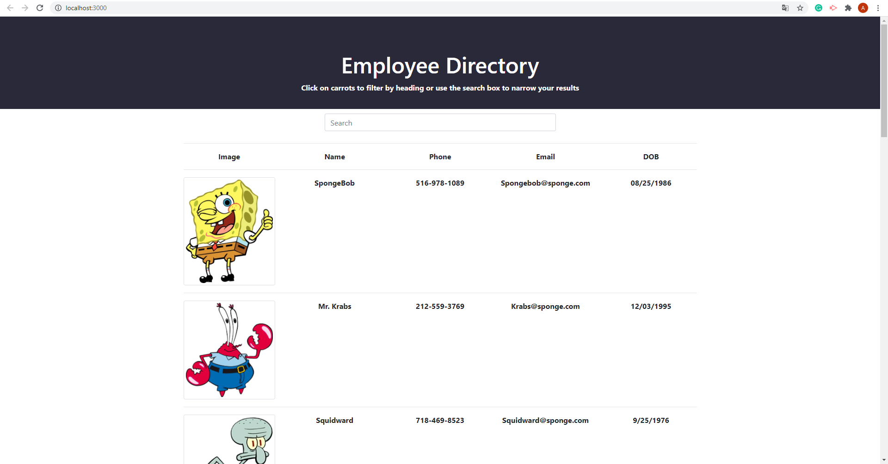
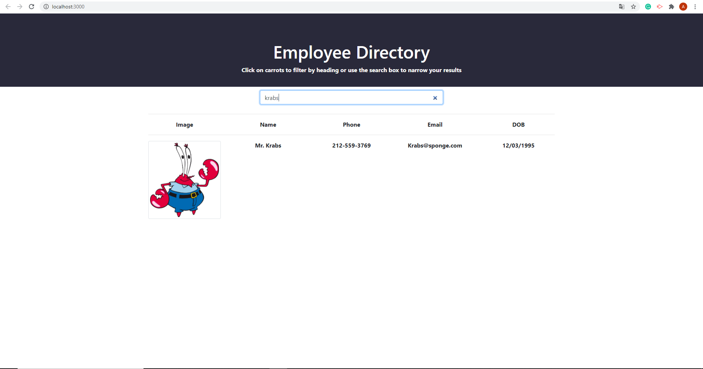

# Unit 19 React Homework: Employee Directory

- Link to
  [Heroku ](https://employeedirectorydeg.herokuapp.com/)
  and
  [GitHub ](https://github.com/DEG18/Employee-Directory)

### Table of Contents

1. [Description](#description)
2. [License](#license)
3. [Contributing](#contributing)
4. [Questions](#questions)

### Description
- For this assignment, I created a employee directory with React. I break up this application's UI into components, manage component state, and respond to user events.

- An employee or manager would benefit greatly from being able to view non-sensitive data about other employees. It would be particularly helpful to be able to filter employees by name, email, phonenumber and DOB.

### License

- MIT

### Contributing

- Luyu Zeng

### Questions
##### Email:
- zengluyu252@gmail.com

### Screen Shots

